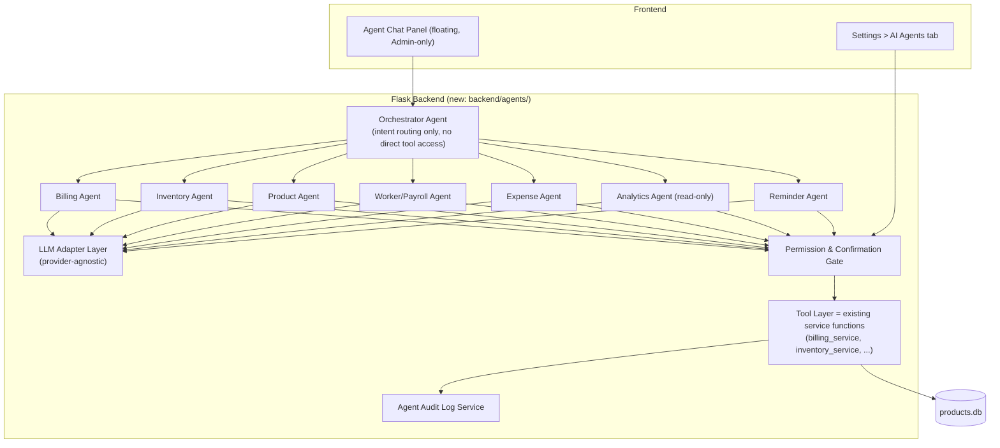
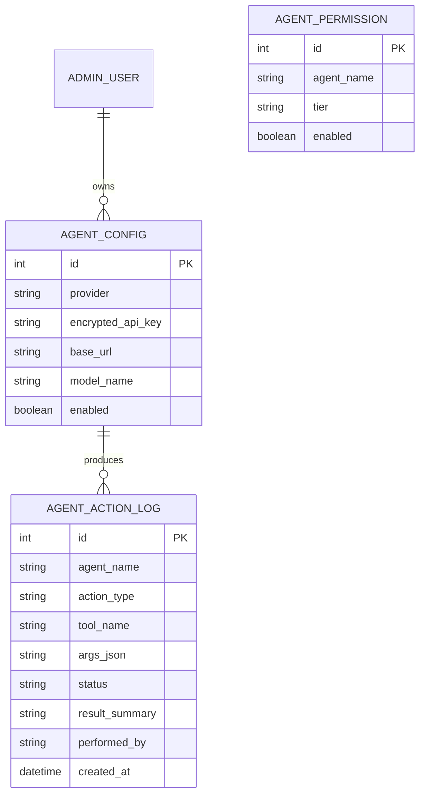

# InfoOS Agentic AI — Design & Implementation Spec

This document specifies how to add a multi-agent, BYO-LLM ("bring your own key") assistant layer to InfoOS Desktop, matching the existing Electron + React + Flask + SQLite architecture from the README. Hand this file to your coding agent as the spec to implement against.

---

## 1. Goals

- One **domain agent** per functional area (Billing, Inventory, Products, Workers/Payroll, Expenses, Analytics, Reminders, Settings), each with a narrow, well-defined toolset — not one giant agent with access to everything.
- User supplies **their own LLM API key** (OpenAI, Anthropic, Google, local/OpenAI-compatible endpoints, etc.) — the app must be provider-agnostic.
- **Workers can never access any agent feature**, at any permission level, under any config.
- Fine-grained **per-agent, per-action permission tiers**, configurable per admin, with a hard confirmation gate for destructive/financial actions.
- **No data may be altered without going through the exact same validated code paths** normal UI actions use — the agent never touches SQLite directly.
- Full **audit log** of every agent action.

---

## 2. High-Level Architecture



**Key architectural rule:** agents never write SQL. Every agent "tool" is a thin wrapper around the *same* Python functions your Flask routes already call (`billing.py`, `inventory.py`, etc.). This means agent actions inherit all existing validation, stock checks, foreign-key integrity, and business rules automatically — the agent cannot bypass them because it has no other way to touch the database.

---

## 3. Domain Agents

| Agent | Scope (tools it may call) | Default Tier | Notes |
|---|---|---|---|
| **Billing Agent** | Create bill, hold bill, void bill (same day), lookup product | Suggest-only | Financial + irreversible-ish, high scrutiny |
| **Inventory Agent** | Adjust stock, set thresholds, view stock | Confirm-required | Stock adjustments always logged with reason |
| **Product Agent** | Create/edit/disable product, variations, categories, groups, image bg-removal | Confirm-required | Never allowed to hard-delete, only disable |
| **Worker/Payroll Agent** | View attendance, mark attendance, record advance, **cannot** run full payroll disbursement autonomously | Confirm-required (disbursement = always manual) | Payroll disbursement moves money — never auto-execute |
| **Expense Agent** | Log expense, categorize, view | Confirm-required | |
| **Analytics Agent** | Read summary/reports, generate export | Auto-execute allowed | Read-only, safe by construction |
| **Reminder Agent** | Create/update/snooze/complete reminders | Auto-execute allowed | Low risk, reversible |

The **Orchestrator** only classifies intent and routes to the right domain agent(s); it holds no tools itself, so a prompt-injection or jailbreak attempt against it cannot directly mutate data.

---

## 4. Permission Model (hard requirements)

1. **Role gate first, before anything else:** `if current_user.role == "worker": return 403` on every single agent endpoint and in the socket/IPC layer. This check must live in middleware (`@admin_only_agent_access`), not scattered per-route, so it can't be forgotten.
2. **Three action tiers**, settable per-agent by the admin in Settings:
   - **Read-only** — agent can query/answer, cannot call any mutating tool.
   - **Suggest & Confirm** (default for anything touching money/stock) — agent proposes a diff (e.g. "Reduce stock of Paneer Tikka by 4 units, reason: wastage") and the UI shows an explicit **Approve / Reject** card before the tool actually runs.
   - **Full Autonomy** — agent may call the tool directly, no per-action confirmation. Only assignable per-agent by the admin, and never available at all for Billing or Worker payroll disbursement (hardcoded ceiling, not just a default).
3. **Hardcoded ceilings that no setting can override:**
   - Worker role → zero agent access.
   - Payroll disbursement, bill voids older than same-day, and product hard-delete → always require explicit human confirmation regardless of tier.
   - Agents can never read or export other users' raw API keys, and never see the encrypted key material — only the backend decrypts it just-in-time to call the LLM.
4. **Every mutating tool call is atomic and logged before commit**, and wrapped in a DB transaction so a failed multi-step agent action rolls back cleanly rather than leaving partial state.

---

## 5. Provider-Agnostic LLM Adapter

Since users bring arbitrary API keys/providers, the backend needs one internal interface that every agent calls, with provider-specific adapters behind it:

```python
# backend/agents/llm_adapter.py
class LLMAdapter:
    def chat(self, messages: list[dict], tools: list[dict], model: str) -> AgentResponse:
        raise NotImplementedError

class AnthropicAdapter(LLMAdapter): ...   # native tool_use blocks
class OpenAIAdapter(LLMAdapter): ...      # function calling / tool_calls
class OpenAICompatibleAdapter(LLMAdapter): ...  # local/self-hosted, Groq, etc — user-supplied base_url
class GoogleAdapter(LLMAdapter): ...

def get_adapter(provider: str, api_key: str, base_url: str | None = None) -> LLMAdapter:
    ...
```

Design notes:
- Normalize all providers to one internal tool-calling schema (name, JSON-schema args, description) and translate at the adapter boundary — agents themselves are written once, provider-independent.
- **Never assume tool-calling quality.** Some user-supplied models/providers are weak at structured tool use. Validate every tool call's arguments against the tool's JSON schema server-side before execution; on a malformed/hallucinated call, return the error to the model as a tool result and let it retry (max N attempts), rather than trusting it.
- **Timeouts + circuit breaker** per request so a slow/broken third-party endpoint can't hang the app.
- **API keys are encrypted at rest** (e.g. Fernet/AES with a key from OS keychain or local secret file, never plaintext in `products.db`), decrypted only in-process for the outbound call, never logged.
- Because InfoOS is offline-first, be explicit in the UI: agent features require internet connectivity to reach the user's chosen LLM provider; everything else in the app keeps working offline.

---

## 6. Database Additions (`backend/models.py`)



- `AGENT_PERMISSION` is the source of truth the Permission Gate reads on every call — one row per agent.
- `AGENT_ACTION_LOG` records proposed, approved, rejected, and executed actions (status: `proposed | approved | rejected | executed | failed`) for a full audit trail visible in Settings.

---

## 7. New Backend Routes (`backend/routes/agents.py`)

| Endpoint | Method | Purpose |
|---|---|---|
| `/api/agents/chat` | `POST` | Admin-only. Send a message, get agent response (may include a pending-confirmation action). |
| `/api/agents/actions/:id/approve` | `POST` | Execute a previously proposed action. |
| `/api/agents/actions/:id/reject` | `POST` | Discard a proposed action. |
| `/api/agents/config` | `GET`, `POST` | Manage provider/key/model per admin. |
| `/api/agents/permissions` | `GET`, `PUT` | Per-agent tier settings. |
| `/api/agents/logs` | `GET` | Audit log, filterable by agent/date/status. |

All routes go through the same `@admin_only_agent_access` decorator described in §4.

---

## 8. New Settings Screen Section (`Settings > AI Agents`)

Add a new tab in `Settings.jsx` alongside `PrinterConfig`, `DisplayZoomControls`, etc.:

- **LLM Connection** — provider dropdown (Anthropic / OpenAI / Google / Custom OpenAI-compatible), API key field (masked, "Test Connection" button), model name, optional base URL.
- **Per-Agent Controls** — a table (Billing, Inventory, Product, Worker, Expense, Analytics, Reminder) with a tier selector (Read-only / Suggest & Confirm / Full Autonomy) per row; Billing and Worker rows visibly disable the "Full Autonomy" option in the UI to reflect the hardcoded ceiling.
- **Master Kill Switch** — one toggle to disable all agent features instantly.
- **Audit Log Viewer** — searchable table backed by `/api/agents/logs`.
- **Data Safety Note** (static text, always visible): explains that agents can never bypass validation, workers never see this feature, and all mutating actions are logged.

This keeps agent config discoverable in the same place as your existing hardware/diagnostics settings, per your existing `Settings` node design.

---

## 9. Frontend Chat Surface

- A floating "Ask InfoOS" panel, admin-role-gated at the component level (`<AdminRoute>`, consistent with `/inventory`, `/management`, etc.) **and** re-checked server-side (never trust a client-side role check alone).
- Renders **Approve / Reject** cards inline for any `Suggest & Confirm`-tier action, showing a human-readable diff (e.g. "Set Paneer Tikka price ₹220 → ₹240") before the user taps Approve, which calls `/api/agents/actions/:id/approve`.
- Streams responses; shows which agent is currently "thinking" (e.g. "Inventory Agent checking stock levels...") for transparency.

---

## 10. Suggested Build Order

1. `AGENT_PERMISSION` + `AGENT_ACTION_LOG` + `AGENT_CONFIG` models and migration.
2. `@admin_only_agent_access` middleware + worker-role hard block (write a test that asserts a worker token gets 403 on every agent route before anything else).
3. LLM Adapter layer with at least Anthropic + OpenAI + one OpenAI-compatible custom endpoint, plus schema-validated tool call execution.
4. One agent end-to-end (recommend **Reminders** first — lowest risk, good for validating the full pipeline) with Suggest & Confirm flow working in the UI.
5. Roll out remaining agents, wiring each to existing service-layer functions only (no new direct DB access).
6. Settings UI + audit log viewer.
7. Security pass: encrypted key storage, log redaction, rate limiting on `/api/agents/chat`, timeout/circuit breaker on the adapter layer.

---
## 11. Token & Cost Optimization
 
Since the user pays the LLM bill directly with their own key, runaway token usage is a trust problem, not just a cost problem. Build these in from day one:
 
1. **Minimal, per-agent system prompts — not one giant prompt.** Each domain agent gets only the instructions and tool schemas relevant to its own scope (e.g. the Reminder Agent never sees Billing/Payroll tool definitions). Smaller tool surface = fewer input tokens per call and less chance of the model picking the wrong tool.
2. **Route before you call the LLM at all.** Use a cheap, deterministic first pass (keyword/intent matcher, or a tiny/cheap model) to decide *which* domain agent should handle a message before invoking the user's chosen (possibly expensive) model. Trivial or malformed requests get rejected without ever reaching the paid LLM.
3. **Cap conversation context aggressively.** Don't replay the entire chat history on every turn:
   - Keep a rolling window (e.g. last 6–10 turns) and summarize anything older into a short system-note instead of resending it verbatim.
   - Never include full database dumps in context — tools should return only the specific rows/fields needed to answer the current request (e.g. "top 5 low-stock items," not the whole inventory table).
4. **Cache tool results and repeated lookups within a session.** If the agent already fetched today's `DailySalesSummary` or the product catalog once, reuse that result for follow-up questions in the same conversation instead of re-querying/re-describing it to the model.
5. **Prefer structured tool results over prose.** Have tools return compact JSON, not prose descriptions — models spend far fewer tokens parsing `{"stock": 12, "threshold": 5}` than a paragraph explaining the same thing, and it reduces hallucination risk too.
6. **Set hard limits, configurable by the admin, in Settings > AI Agents:**
   - Max tokens per response (`max_tokens` on every call).
   - Max tool-call round-trips per user message (e.g. 3–5) before the agent must stop and ask the user rather than looping.
   - Max messages/requests per day or per session (a simple counter in `AGENT_ACTION_LOG` or a new `AGENT_USAGE` table), with a friendly "daily AI limit reached" message once hit.
   - A live **token/cost estimate** shown in the chat panel per session, computed from the provider's published rate for the selected model (maintain a small static `model_pricing.json` the admin can update).
7. **Short-circuit for read-only/analytics questions.** Many questions ("what were yesterday's sales?") don't need the LLM to reason at all — have the Analytics Agent try a direct pattern match against `/api/summary`/`/api/reports` first, and only fall back to an LLM call for genuinely open-ended questions.
8. **Avoid unnecessary re-generation.** For Suggest & Confirm actions, don't re-call the LLM to "confirm" — once the human approves, execute the already-generated tool call directly. The confirmation step is a UI gate, not a new prompt.
9. **Use the cheapest capable model per agent, not one model for everything.** Let the admin optionally set a different (cheaper/faster) model for low-stakes agents like Reminders/Analytics, and reserve their strongest model only for agents that need more reasoning (Product/Inventory edits).
10. **Log token usage per call** (`input_tokens`, `output_tokens`, `estimated_cost`) alongside every `AGENT_ACTION_LOG` row, feeding the Settings audit log and giving the admin visibility into exactly where spend is going.
---

## 12. Non-Negotiable Guardrails (checklist for code review)

- [ ] Worker role blocked at middleware level on every agent route.
- [ ] No agent tool executes raw SQL — only calls existing validated service functions.
- [ ] Billing voids, payroll disbursement, and product hard-delete always require human confirmation, independent of tier setting.
- [ ] API keys encrypted at rest, never written to logs.
- [ ] Every mutating action logged to `AGENT_ACTION_LOG` before/after execution.
- [ ] Tool-call arguments validated against JSON schema before execution, for any provider/model.
- [ ] Master kill switch instantly disables all agent routes.
