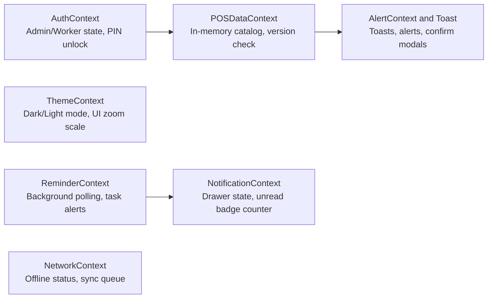
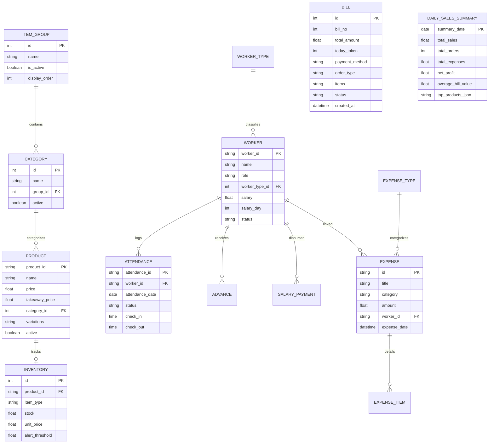
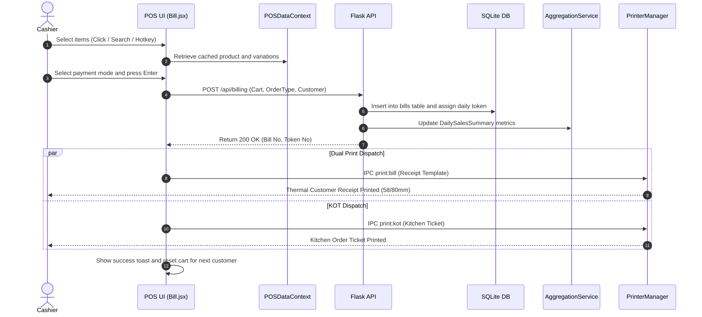
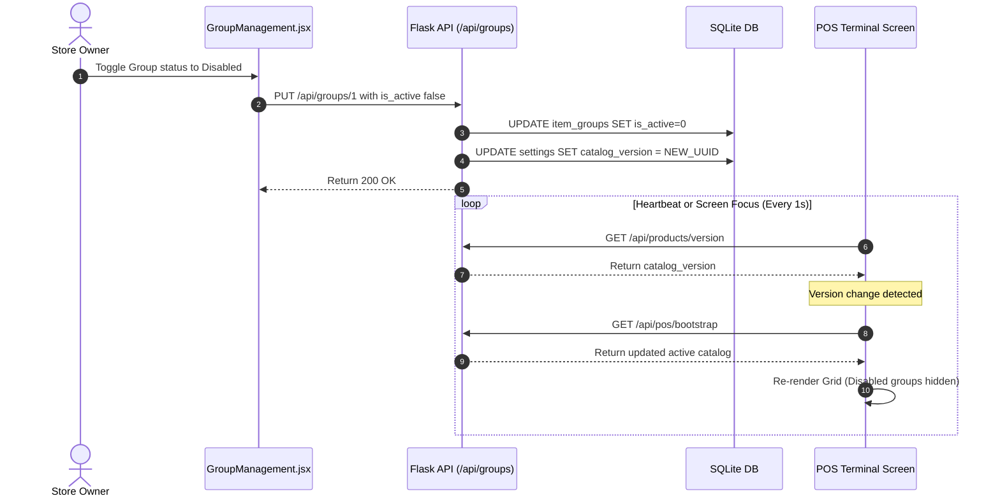
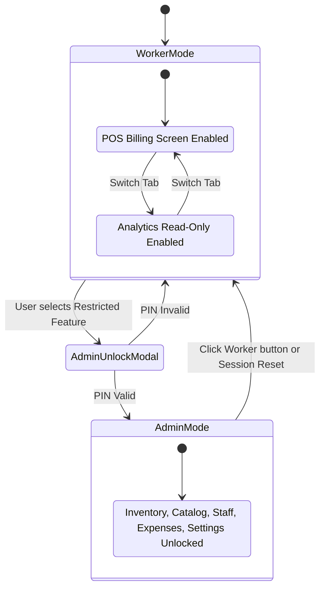
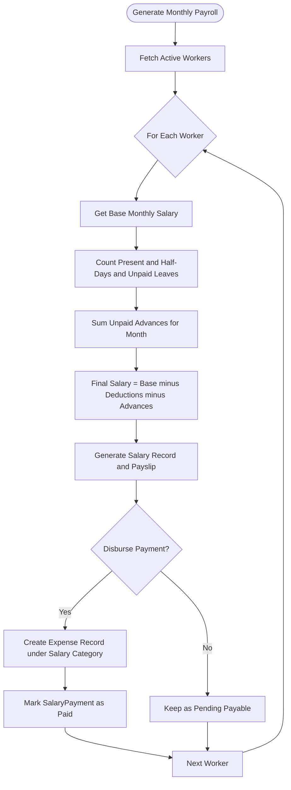

# InfoOS Desktop - Next-Generation Offline POS & Enterprise Store Management

[](package.json)
[](electron/main.js)
[](package.json)
[](electron/assets/license.txt)

> **InfoOS Desktop** is a zero-latency, 100% offline-first Point of Sale (POS) and comprehensive retail/restaurant operations suite built for high-throughput billing, inventory control, automated staff payroll, daily expense tracking, and real-time sales analytics.

---

## ⚡ 10-Second Executive Summary

```
┌─────────────────────────────────────────────────────────────────────────────────────────┐
│                                     INFOOS AT A GLANCE                                  │
├──────────────────────────┬───────────────────────────┬──────────────────────────────────┤
│ 🛒 High-Speed POS        │ 👥 Worker & Payroll       │ 📊 Analytics & BI                │
│ • Sub-second checkout    │ • Attendance tracking     │ • Pre-aggregated instant stats   │
│ • ESC/POS 58/80mm print  │ • Advances & salary calc  │ • Real-time revenue & net profit │
│ • KOT kitchen routing    │ • Role-Based PIN Lock     │ • Excel (.xlsx) & CSV export     │
├──────────────────────────┼───────────────────────────┼──────────────────────────────────┤
│ 📦 Inventory & Menu      │ 💸 Expense Accounting     │ 🤖 AI & Ergonomics               │
│ • Direct sale & raw mats │ • Categorized spend logs  │ • AI image background remover    │
│ • Variations & modifiers │ • Direct payroll linking  │ • Alt popup scratchpad calc      │
│ • Live <1s group sync    │ • Net profit deduction    │ • Ctrl group cycle hotkeys       │
└──────────────────────────┴───────────────────────────┴──────────────────────────────────┘
```

---

## 🏛️ System Architecture Topology

InfoOS Desktop follows a **three-tier offline local hybrid architecture**:
1. **Frontend Presentation**: React 18 inside an Electron container with GPU-accelerated glassmorphic UI, load-once context state caching, and responsive typography scaling.
2. **Local Middleware API**: An embedded Python 3 Flask REST service providing business logic, SQLite ORM models, background aggregation workers, and AI ONNX models.
3. **Device & Persistence Layer**: Zero-dependency local SQLite database (`products.db`), direct ESC/POS hardware printer spoolers, and secure IPC bridges.

```mermaid
flowchart TB
    subgraph UI_Tier [Tier 1: Electron and React Presentation Layer]
        Shell["Electron Main Process (main.js)"]
        IPC["Secure IPC Bridge (preload.js)"]
        ReactApp["React 18 Single Page App (App.jsx)"]
        
        subgraph UI_Screens [Active Screen Nodes]
            POS_Screen["POS Billing (/ - Bill.jsx)"]
            Analytics_Screen["Analytics and Reports (/analytics)"]
            Inventory_Screen["Inventory Management (/inventory)"]
            Product_Screen["Catalog and Groups (/management)"]
            Workers_Screen["Staff and Payroll (/workers)"]
            Expenses_Screen["Expense Tracking (/expenses)"]
            Reminders_Screen["Reminders and Tasks (/reminders)"]
            Settings_Screen["System and Hardware (/settings)"]
        end

        subgraph State_Engine [Context and State Engine]
            POSCtx["POSDataContext (Catalog Cache)"]
            AuthCtx["AuthContext (Admin/Worker RBAC)"]
            NotifCtx["NotificationContext (Alert Bus)"]
            SettingsCtx["SettingsContext (Store Config)"]
        end
    end

    subgraph Backend_Tier [Tier 2: Embedded Python Flask API Layer]
        Flask["Flask REST API Gateway (app.py : 5050)"]
        
        subgraph Route_Handlers [REST Route Handlers]
            R_Billing["/api/billing (Transactions)"]
            R_Products["/api/products and /groups"]
            R_Inventory["/api/inventory (Stock)"]
            R_Workers["/api/workers and /worker_types"]
            R_Expenses["/api/expenses (Spend)"]
            R_Analytics["/api/summary and /reports"]
            R_Reminders["/api/reminders and /notifications"]
        end

        subgraph Core_Services [Background and Processing Services]
            AggService["Aggregation Service (Daily Summary)"]
            PrintService["ESC/POS Formatter (printer_service.py)"]
            ExcelService["Excel and XLSX Service"]
            AIModel["AI Image Normalizer (ONNX rembg)"]
        end
    end

    subgraph Storage_Hardware [Tier 3: Local Hardware and Storage]
        DB[("Local SQLite Storage (products.db)")]
        Printers["Thermal Printers (USB / LAN / Windows)"]
        FileSystem["Local Export and Backup Files"]
    end

    Shell <--> IPC
    IPC <--> ReactApp
    ReactApp --> UI_Screens
    UI_Screens <--> State_Engine
    State_Engine --> Flask
    Flask --> Route_Handlers
    Route_Handlers --> Core_Services
    Core_Services <--> DB
    Shell --> Printers
    Core_Services --> Printers
    Core_Services --> FileSystem
```



---

## 🧭 Complete Application Node Directory

For developers, maintainers, and LLMs parsing this system, here is the complete map of every functional node across the desktop application:

### 1. Frontend UI Nodes (`frontend/src/components/screens/`)

| Node Identifier | Route Path | Access Role | Primary Responsibilities | Key Child Components |
| :--- | :--- | :--- | :--- | :--- |
| **`WorkingPOSInterface`** | `/` | All (Worker / Admin) | High-speed item search, Category tabs, Group switching, Cart modifier rules, Split payment, Direct Receipt/KOT printing, Token numbers | `CartSummary`, `ReceiptPreviewModal`, `QuickPay`, `HoldBills` |
| **`Analytics`** | `/analytics` | All (Worker / Admin) | Real-time KPI summaries, Revenue vs Cost, Group share charts, Hourly footfall heatmaps, Payment mode shares, Excel/CSV export | `MetricCard`, `SalesTrendChart`, `TopProductsList`, `DateRangeFilter` |
| **`Inventory`** | `/inventory` | **Admin Only** | Stock levels, Raw materials vs Direct sale stock, Cost per unit tracking, Low stock alert thresholds, Manual stock adjustments | `StockTable`, `StockAdjustmentModal`, `ThresholdBadge` |
| **`ProductManagement`** | `/management` | **Admin Only** | Product CRUD, Variation matrix (S/M/L), Image upload with AI background eraser, Category & Group association, Display sorting | `ProductModal`, `GroupManagement`, `CategoryManager`, `AIImageUploader` |
| **`WorkersDashboard`** | `/workers` | **Admin Only** | Staff directory, Role definitions, Daily attendance check-in/out, Salary advance approvals, Monthly payroll disbursement | `WorkerList`, `WorkerProfile`, `Attendance`, `SalaryManager` |
| **`Expenses`** | `/expenses` | **Admin Only** | Multi-item operational expense vouchers, Vendor bills, Salary linking, Payment method selection, Expense category manager | `ExpenseModal`, `ExpenseTypeManager`, `ReceiptItemRow` |
| **`Reminders`** | `/reminders` | All (Worker / Admin) | Scheduled business alerts (once, daily, weekly, monthly), Task snooze/complete, Notification center synchronization | `ReminderCard`, `NewReminderModal`, `NotificationCenterDrawer` |
| **`Settings`** | `/settings` | **Admin / PIN** | Shop metadata (GST/Tax, Address), Thermal printer setup (58/80mm, USB/LAN), Keyboard billing locks, Developer diagnostics, Log streamer | `PrinterConfig`, `DisplayZoomControls`, `DiagnosticsPanel`, `BackupManager` |

---

### 2. Frontend State & Context Nodes (`frontend/src/context/`)



- **`POSDataContext`**: Eliminates redundant network calls by caching active categories, groups, and products in-memory. Polls catalog version hash for background invalidation.
- **`AuthContext`**: Manages Admin vs Worker authorization. Restricts management screens via `<AdminRoute>` and opens `<AdminUnlockModal>` when worker attempts privileged actions.
- **`SettingsContext`**: Holds shop profile, currency symbol (`₹`), and hardware printer device routes.

---

### 3. Backend REST Service Nodes (`backend/routes/`)

| Endpoint Prefix | Source File | HTTP Methods | Node Function |
| :--- | :--- | :--- | :--- |
| **`/api/billing`** | `billing.py` | `POST`, `GET`, `DELETE` | Processes bills, assigns daily token numbers, records line items, and updates pre-aggregated sales stats. |
| **`/api/products`** | `products.py` | `GET`, `POST`, `PUT`, `DELETE` | Product inventory CRUD, variation models, image uploads, category links, and catalog version bumps. |
| **`/api/groups`** | `groups.py` | `GET`, `POST`, `PUT`, `DELETE` | Item group management, display order sorting, and instant enable/disable toggles. |
| **`/api/inventory`** | `inventory.py` | `GET`, `POST`, `PUT` | Tracks stock count, cost valuation, direct sales, raw materials, and threshold alerts. |
| **`/api/workers`** | `workers.py` | `GET`, `POST`, `PUT`, `DELETE` | Worker profiles, daily attendance logging, advances recording, and payroll calculations. |
| **`/api/expenses`** | `expenses.py` | `GET`, `POST`, `PUT`, `DELETE` | Operational vouchers, itemized purchase bills, worker salary deductions. |
| **`/api/summary`** | `summary.py` | `GET` | High-speed aggregated metrics reading directly from `DailySalesSummary` table. |
| **`/api/reports`** | `reports.py` | `GET` | Generates professional Excel sheets (`.xlsx`) and raw `.csv` reports with branded headers. |
| **`/api/reminders`** | `reminders.py` | `GET`, `POST`, `PUT`, `DELETE` | Crud & lifecycle management for scheduled operational tasks. |
| **`/api/notifications`**| `notifications.py`| `GET`, `POST`, `PUT` | System notifications, priority queue, read/dismiss status. |
| **`/api/settings`** | `settings.py` | `GET`, `POST` | Persistent key-value application preferences stored in SQLite. |

---

### 4. Database Entity & Schema Nodes (`backend/models.py`)



---

## 🔄 Core System Workflows

### 1. High-Throughput Billing & Thermal Printing Flow



---

### 2. Real-Time Catalog Versioning & Live Group Toggle



---

### 3. Role-Based Access Control (RBAC) Flow



---

### 4. Monthly Staff Payroll Calculation Flow



---

## ⌨️ Ergonomics & Keyboard Shortcuts

Designed for split-second checkout speeds without touching the mouse:

| Action | Shortcut | Scope | Behavior |
| :--- | :--- | :--- | :--- |
| **Cycle Active Item Groups** | `Ctrl` | POS Billing | Instantly advances to next enabled product group tab |
| **Cycle Category Tabs** | `Tab` / `Shift + Tab` | POS Billing | Moves focus across top categories |
| **Toggle Scratchpad Calculator** | `Alt` | Everywhere | Opens/closes liquid glass popup calculator (Full keyboard calculation enabled) |
| **Start New Bill** | `F5` | POS Billing | Instantly resets active cart and starts fresh transaction |
| **Print & Checkout** | `Enter` | POS Billing Modal | Confirms payment and triggers thermal receipt print |
| **Search Products** | `Ctrl + F` | POS & Inventory | Focuses search query bar |
| **Toggle Fullscreen** | `F11` | Application | Toggles kiosk/desktop full screen window |
| **Reload Window** | `Ctrl + R` | Application | Soft reloads web view |
| **Toggle Developer Tools** | `Ctrl + Shift + I` | Electron Mode | Opens Chromium DevTools console |

---

## 🖥️ Calculator Floating Scratchpad

Pressing `Alt` anywhere opens the integrated liquid-glass calculator:
- **Full Numpad Support**: Type numbers `0-9`, `.`, operators `+`, `-`, `*` (or `x`), `/`, `%`.
- **Keyboard Actions**: `Enter` or `=` to calculate, `Backspace` to delete, `Escape` or `C` to clear/close.
- **Mouse + Touch Ready**: Smooth micro-animations with bright contrast keys.

---

## 🛠️ Developer Setup & Execution

### Prerequisites
- **Node.js**: v18.0+ & npm v9.0+
- **Python**: v3.10+ (Windows 64-bit recommended)
- **C++ Build Tools**: For native node modules (optional)

### Method 1: Instant Development Launcher
Double-click `start_dev.bat` or run:
```bash
npm run dev
```
*Launches Python backend on port 5050 and React Webpack Dev Server on port 3050.*

### Method 2: Manual Terminal Startup

1. **Backend Service**:
   ```bash
   cd backend
   python -m venv .venv
   .venv\Scripts\activate
   pip install -r requirements.txt
   python app.py --port 5050
   ```

2. **Frontend Service**:
   ```bash
   cd frontend
   npm install
   npm start
   ```

3. **Electron Shell**:
   ```bash
   npm run electron
   ```

---

## 📦 Production Packaging & Distribution

InfoOS packages into a single, zero-dependency Windows `.exe` installer using PyInstaller for the Python backend and `electron-builder` with NSIS compression.

```bash
# Full automated end-to-end production build
npm run build-all
```

**What this does:**
1. Compiles React frontend to optimized production static bundle in `frontend/build/`.
2. Packages Python Flask backend into standalone executable `backend/dist/backend/backend.exe` via PyInstaller.
3. Packages Electron shell, assets, and bundled backend into a high-compression NSIS installer in `dist/InfoOS Setup.exe`.

---

## 🤖 LLM & Machine Context Specification

> This section provides machine-readable metadata for AI assistants, agents, and automation scripts.

```json
{
  "system_name": "InfoOS Desktop",
  "app_id": "com.burgerbhau.infoos",
  "architecture": "Electron-React-Flask-SQLite Hybrid",
  "default_ports": {
    "frontend_dev": 3050,
    "backend_api": 5050
  },
  "database": {
    "engine": "SQLite 3",
    "filename": "products.db",
    "orm": "Flask-SQLAlchemy",
    "optimization": "Pre-aggregated DailySalesSummary table with real-time row triggers"
  },
  "security_model": {
    "role_based_access": ["worker", "admin"],
    "admin_protected_routes": ["/inventory", "/management", "/workers", "/expenses", "/settings"],
    "worker_allowed_routes": ["/", "/analytics", "/reminders"]
  },
  "printing_subsystem": {
    "protocol": "ESC/POS Raw Stream + OS Spooler",
    "supported_widths": ["58mm", "80mm"],
    "interfaces": ["USB", "LAN/Network", "Serial COM", "Windows Spooler"]
  },
  "ai_capabilities": {
    "module": "backend/ai",
    "features": ["Background removal", "Aspect normalization", "Thumbnail generation"],
    "engine": "ONNX / rembg"
  }
}
```

---

## 📄 License & Attribution

Copyright © 2026 **InfoOS Private Limited**. All rights reserved.
Unauthorized copying, modification, distribution, or decompilation of this software via any medium is strictly prohibited.
